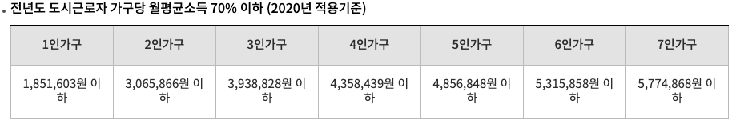
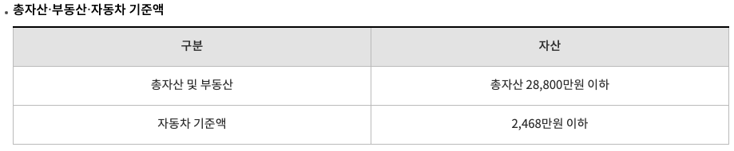
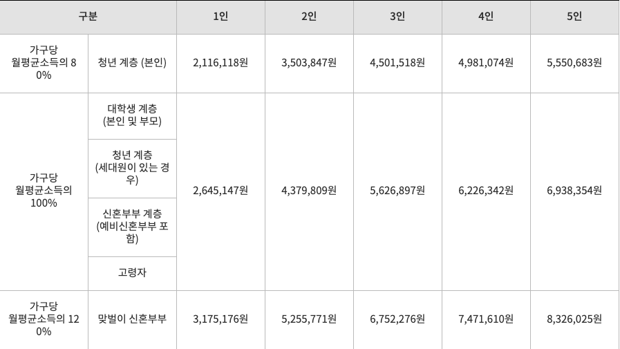

이사계획서
=======
참여자
-------
* 덕현(만 24세)
* 윤영(만 23세)
* 용현(만 28세 / 전세자금대출 1억)
* 엄마(만 54세)
* 아저씨(만 57세)

## 종류
### 케이스
1. 용현집(월세돌림) + 25평 이상 집
    - 방법1: 엄마 신용대출 + 덕현 신용대출 + 윤영 신용대출 + 아저씨 기존집 매매
    - 방법2: 엄마 전세대출 + 덕현 신용대출 + 윤영 신용대출 + 아저씨 기존집 매매
    - 방법3: 덕현 전세대출 + 엄마 신용대출 + 윤영 신용대출 + 아저씨 기존집 매매
    - 방법4: 엄마 전세대출 + 엄마 신용대출 + 윤영 신용대출 + 아저씨 담보대출
    - 방법5: 덕현 전세대출 + 엄마 신용대출 + 윤영 신용대출 + 아저씨 담보대출

2. 용현집(가족) + 오피스텔/원룸(월세돌림)
    - 엄마명의
    - 덕현명의
    - 윤영명의

3. 용현집(가족) + 오피스텔/원룸
    - 엄마명의
    - 덕현명의
    - 윤영명의

4. 25평 이상 집
    - 방법1: 용현 전세대출 + 엄마 신용대출 + 덕현 신용대출 + 윤영 신용대출
    - 방법2: 용현 전세대출 + 엄마 신용대출 + 덕현 신용대출 + 윤영 신용대출 + 아저씨 기존집 매매
    - 방법3: 용현 전세대출 + 엄마 신용대출 + 덕현 신용대출 + 윤영 신용대출 + 아저씨 담보대출

### 주택 지원형
1. 국민임대주택
    - 임대기간 : 기본계약 2년(2년마다 재계약 가능, 최장 30년)
    - 공급규모 : 주로 전용면적 39㎡, 49㎡, 59㎡ 공급
    - 임대조건 : 보증금+임대료(시중 시세의 60%~80% 수준)
    - 특징
        - 평균 보증금이 3,700만원, 임대료는 28만원으로 시중의 전세 시세에 비해 60~80% 수준으로 저렴하게 공급
        - 소득수준과 자산보유액에 따라서 신청자격에 제약
        - 소득이 적은 세대 대상
        - 2년 단위로 재심사

    - 입주자격
        1. 현재 서울시에 거주하는 무주택 세대구성원으로서 SH서울주택도시공사의 공고문에 명시된 소득 및 자산보유 기준에 해당하는 자
        2. 전용면적 50㎡ 미만
            - 도시근로자 가구당 월평균소득의 50% 이하인 무주택 구성원에게 먼저 공급하고 남은 주택이 있는 경우 70% 이하인 자에게 공급
            - 입주자 모집공고일 현재 해당주택 건설 시ㆍ군ㆍ자치구 거주자별 순위 적용
        3. 전용면적 50㎡ 이상~60 ㎡이하
            - 무주택 세대구성원 소득액의 합이 가구원수별 가구당 월평균소득의 70% 아하인 세대에 공급
            - 주택청약종합저축 가입 회차별 순위 적용

    

    

    - [참고](https://www.seoulhousing.kr/html/0101005.do)

2. 행복주택
    - 임대기간
        - 기본계약 2년
        - [2년마다 재계약, 대학생ㆍ사회초년생 계층ㆍ신혼부부 계층ㆍ산업단지 근로자 6년(단, 취업준비생은4년), 고령자ㆍ주거급여수급자ㆍ기존 거주자20년]
    - 공급규모 : 전용면적 30㎡이하~ 45㎡ 이하
    - 임대조건 : 보증금+임대료(시중 시세의 60%~80% 수준)
    - 특징: 공급물량 중 80% 이상을 신혼부부, 사회초년생, 대학생 등에 우선 공급
    - 입주자격
        1.  무주택세대구성원
        2. 주택공급신청자는 성년자(자녀를 부양하거나 직계존속의 사망, 실종신고 및 행방불명 등으로 형제자매를 부양하여야 하는 세대주인 미성년자를 포함)인 무주택세대구성원을 말하며, 단, 대학생, 청년, 예비신혼부부는 성년자가 아닌 경우에도 신청 가능
        3. 1세대 1주택만 신청 가능, 중복 신청할 경우 전부 무효 처리
        4. 예비신혼부부(본인 및 예비배우자)는 1세대로 간주하여 다른 계층을 중복으로 신청할 경우에는 전부 무효처리
        5. 과거 또는 현재 행복주택에 입주한 사실이 있는 자는 입주당시의 공급대상자격(자격 변동 포함)과 동일한 자격으로 신청할 수 없음

    
    
    [참고](https://www.seoulhousing.kr/html/0101006.do)

2. 공공임대주택
    - 주택 청약 통장 필요
    - 필수 임대기간 지나면 분양 전환 가능
    - 전용면적 25.7평 이하 / 5년 이상 임대하는 모든 주택
    - 영구임대주택, 국민임대주택, 50년 임대주택, 5년 임대 공공임대주택

3. 장기전세임대주택
    - 계약기간 2년 / 최장 20년까지 재계약 가능

1. 보증금 지원형 장기안심주택
    - 전세보증금30% / 최대 4,500만원
    - 최장 10년(2년마다 갱신)
    - 서울시 지원
    - 전용면적 60 제곱미터 이하(2인 이상인 가구 전용면적 85제곱미터 이하)
    - 전세보증급 2억 9천만원(2인 이상인 가구는 3억 8천만원)
    - 월세는 50만원 이하

2. 버팀목 전세대출
- 85제곱미터이하
- 임차보증금 2억원(수도권 3억원 이하)
- 임대차계약을 체결하고 임차보증금의 5% 이상을 지불한 자
- 

[참고](https://post.naver.com/viewer/postView.nhn?volumeNo=10927895&memberNo=37962600)